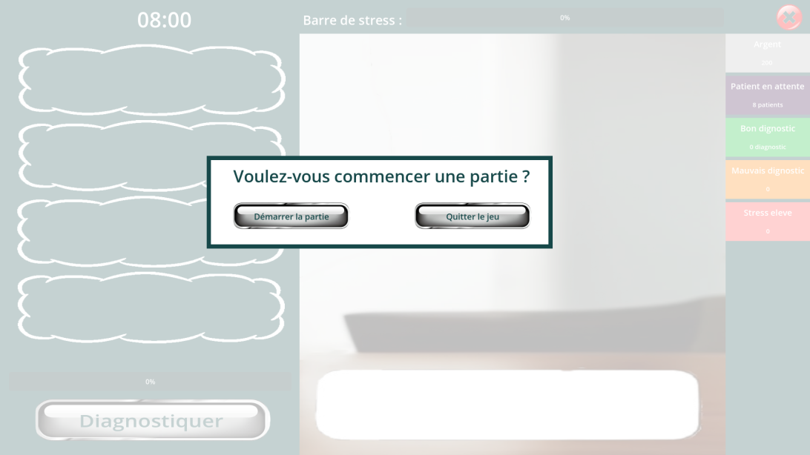
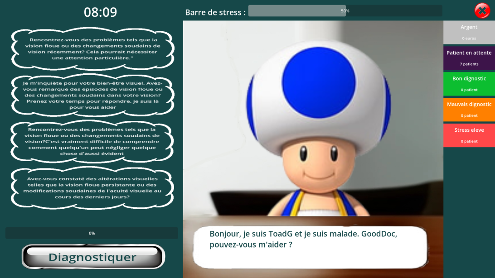
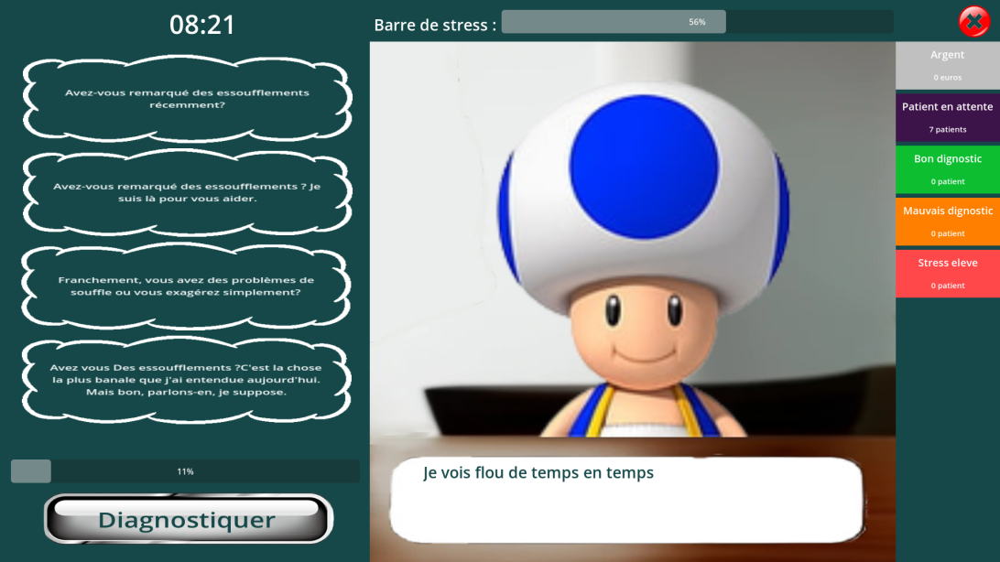
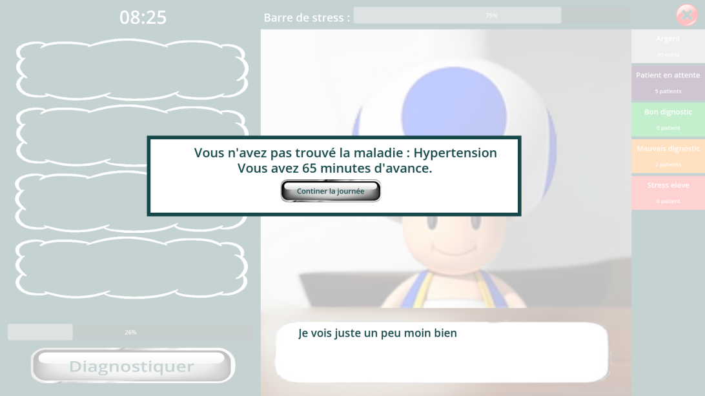

# T3-2023

## **JAL-23-t3-B**

### “GoodDoc”

> **Projet réalisé par :**  
- Thomas ROTT
- Saïf ZOUAOUI MAHJOUB
- Yann GLADY
> 

## Table des matières

* [Présentation](#présentation)
    * [Objectif](#objectif)
    * [But du jeu](#but-du-jeu)
    * [Détails d'une partie](#détails-dune-partie)
* [Comment jouer au jeu](#comment-jouer-au-jeu)
    * [Captures d’écran](#captures-décran)
* [Cahier des charges](#cahier-des-charges)
    * [Outils utilisés](#outils-utilisés)
* [Installation](#installation)
    * [Linux avec sudo](#linux-avec-sudo)
    * [Windows](#windows)
    * [MacOS](#macos)
* [Documentation](#documentation)
* [License](#license)

## Présentation

### Objectif

“GoodDoc” est un jeu sérieux permettant au joueur de prendre conscience qu’une consultation avec un médecin généraliste peut avoir un impact sur l’expérience subjective d’un patient et modifier son point de vue / ressentis vis-à-vis de son problème.

### But du jeu

Le joueur joue le rôle d’un médecin qui reçois un patient en consultation et doit choisir les bonnes questions à poser au patient afin que son expérience subjective soit la plus agréable possible, tout en trouvant sa maladie.

### Détails d’une partie

Le joueur joue le rôle d’un médecin généraliste, la partie débute avec l’arrivée d’un patient.

Le joueur doit alors choisir parmi 4 questions afin de dialoguer avec le patient et trouver sa maladie.

Ces questions auront un impact plus ou moins important sur le stress du patient ainsi que sur la progression du diagnostic.

Attention, si le niveau de stress est trop haut, le patient aura plus de mal à répondre aux questions et sera susceptible de mentir. Si le stress dépasse 100%, le patient fera une crise et quittera la salle.

Il est important de trouver un équilibre entre des questions gentilles qui calmeront le patient, et des questions plus directes qui feront avancer le diagnostic.

La partie se termine lorsque le joueur aura fini la consultation au bout de 4 questions posées ou lorsque le niveau de stress du patient aura atteint son niveau maximum. Le joueur peut également décider de conclure l'examination quand il le souhaite, les chances de diagnostiquer la bonne maladie dépendant du taux de progrès du diagnostic. Un bilan sera alors affiché quant au succès de l'examen.

## Captures d’écran

## Cahier des charges

Lien vers le cahier des charges : [Cahier des charges](https://docs.google.com/document/d/1KdIvdUg-Gb4mh5ODGvXxjoQEcYubZFA6AtUeCHMjDzw/edit#)

### Outils utilisés

- Godot 4/C#
- SQLite
- IDE Rider

## Installation

Télécharger la dernier version du release pour votre system.
Unzip l'archive.

* Il faut avoir une connection à Internet pour le premier lancement.

### Linux avec sudo

* Si c'est votre premier lancement, lancer le script 'PackageInstaller.sh'
* Ensuite lancer le script 'GoodDoc.sh'

### Windows 

* Lancer l'executable 'GoodDoc.exe'

### MacOS

Le jeu est compatible puce Intel (M1 a tester) à partir de la version MacOS High Sierra.

* Lancer l'executable 'GoodDoc.app'

## Documentation

Lien vers la documentation : [Documentation](https://t3gooddoc.pages.unistra.fr/t3GoodDoc/) (Format Web)

## License

Ce projet est sous licence MIT - voir le fichier [LICENSE](LICENSE) pour plus de détails.